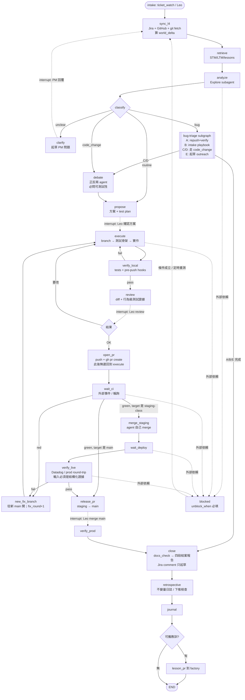

# Ticket Lifecycle Graph — 從收到 ticket 到 Done 的狀態機

> 規劃稿 v1，2026-10-09。給 Leo 決定「要不要做、deploy 在哪」用。沒有任何 code。
> 主幹是 `framework/WORK-LOOP.md` 的九步；bug ticket 走 `bug-triage` skill 當 subgraph；
> 閘門來自 `lis-prod-change-gate` 與 CLAUDE.md 的 git 規則；
> 設計原則來自 `framework/ENFORCEMENT-LADDER.md`：能寫成邊的規則就不寫成提醒。

## 0. 一句話

每張 ticket 一個 thread（`thread_id = ticket id`），state 存在 checkpointer；每個 phase 是一個節點，
節點裡真正動手的是 `claude -p` 加對應 skill 的 worker；人要裁決的地方是 `interrupt`，
外部事件（CI、merge、PM 回覆）到了就 resume。LangGraph 在這裡扮演的是**耐久狀態機加路由**，
不是智慧；智慧在 worker 裡，規則在邊上。

## 1. 為什麼這一層值得用 LangGraph（而 HL7 日報不值得）

| 條件 | ticket 生命週期 |
|---|---|
| 有往回指的邊 | review 退回 → execute；verify live 失敗 → 新 branch → 新 PR；需求不清 → 等 PM → 重新 analyze |
| 中途要等人或外部事件 | 方案確認、review、Leo merge main、PM 回覆、CI、deploy |
| state 要跨程序、跨天存活 | 一張票平均橫跨 2–5 天，中間 Mac 會睡、session 會 compact |
| 多張票同時卡在不同閘門 | ticket_watch 目前每天用 prompt 手工重算「每張卡在哪」 |

四條全中。對照 HL7 日報：零往回邊、零閘門、單次執行，所以那邊是 DAG。

## 2. State schema（每張 ticket 一份）

```python
class TicketState(TypedDict, total=False):
    # identity / world
    ticket_id: str                  # thread_id
    ticket: dict                    # Jira snapshot: status, summary, AC, assignee, labels, last_comment_at
    last_l4_sync: str               # ISO time; 每次 resume 第一件事就是刷新
    world_delta: list[str]          # 上次 checkpoint 之後世界變了什麼（PR 被別人 merge、ticket 改派……）

    # classification
    ticket_class: str               # routine | code_change | bug_A..E | unclear | not_mine
    precedent: list[str]            # routine 時引用的過去 ticket / STM id

    # plan
    approaches: list[dict]          # Step 2/3 產物
    chosen_plan: dict               # Step 4 Leo 確認的方案
    test_plan: dict                 # 沒有這個不能進 execute（結構上擋，見 §5）
    lessons_injected: list[str]     # Step 1.4 抄進來的 1–2 條

    # execution
    repo: str; branch: str
    test_skeleton_commit: str       # execute 的前置產物；空 → 不准寫實作
    commits: list[str]
    local_verify: dict              # tests / pre-push hook 結果

    # review & delivery
    review_round: int               # cycle 計數，上限 3
    pr: dict                        # number, head_sha, target, url；一個 PR 一個 head
    ci: dict                        # status, run_url, checked_at
    staging: dict                   # merged_sha, deployed_at, deploy_verified
    live_verify: dict               # Datadog / prod round-trip 證據（結構化，不是「我覺得」）
    fix_round: int                  # verify 失敗開新 PR 的次數，上限 2
    release_pr: dict                # staging → main，只有 Leo merge

    # closure
    docs_check: dict; closing_report: str; retro: dict; journal_path: str
    lesson_pr: str | None

    # control
    gate: dict | None               # {kind, waiting_on, since, unblock_when}  正在等誰、等什麼
    blocked: dict | None            # 外部依賴；unblock_when 必填（同 STM frontmatter 規則）
    actions: Annotated[list[dict], operator.add]   # 每個節點做了什麼（審計軌跡，產生 STM 用）
    stm_path: str
```

STM markdown 不再是手寫的真相來源，而是由 `actions` 與 state **渲染**出來的審計檔，
每個 checkpoint 之後重新渲染一次。dream pipeline 讀到的格式不變。

## 3. 圖



虛線 = `interrupt`（程序結束，等事件 resume）。每次 resume 都先經過 `sync_l4`，
因為 checkpoint 裡的 state 是記憶，不是世界（原則 0 與原則 5）。

### 迴圈（往回指的邊）

| 迴圈 | 出口條件 | 上限 |
|---|---|---|
| verify_local → execute | 測試與 hook 綠 | 5 |
| review → execute | Leo 說 OK | review_round 3，超過轉 blocked 給人 |
| CI red / verify_live fail → new_fix_branch → execute → … → open_pr | CI 綠且 live 驗證過 | fix_round 2 |
| clarify → (PM) → sync_l4 → analyze | ticket_class 不再是 unclear | 無上限，但每輪都是 interrupt |

### 閘門（interrupt，等人）

| 閘門 | 誰 | 對應規則 |
|---|---|---|
| 方案確認 | Leo | WORK-LOOP Step 4 |
| Review | Leo | WORK-LOOP Step 6 |
| merge main | Leo | CLAUDE.md「agent 不 merge main」 |
| PM 回覆 | PM / requester | ticket-requirements-clarify |
| whitelist 外的 prod 寫入 | Leo | prod-change-gate Gate 7、bug-triage Step 7 |
| 對外送出（Jira comment、Slack、vendor 信） | Leo | 「只起草不發」 |

## 4. 節點與 worker 的介面

每個動手的節點都是同一個形狀：

```
inputs  : state 子集（schema 固定）+ skill 名 + allowed tools 清單
worker  : claude -p --json-schema <節點輸出 schema> --allowedTools <清單> --model fable
          cwd = 該 ticket 的 repo worktree；prompt = skill 本文 + state 片段
outputs : 結構化 JSON → 合併進 state；同時 append 到 actions
```

重點是 **allowedTools 由節點決定，不由模型決定**：

| 節點 | 工具 |
|---|---|
| sync_l4 / retrieve / analyze | Read, Grep, Glob, Bash(唯讀 git / gh / jira REST) |
| execute | 以上 + Edit, Write, Bash(git checkout -b / commit)；**沒有 push** |
| open_pr | Bash(git push 自己的 branch, gh pr create)；**沒有 Edit** |
| merge_staging | Bash(gh pr merge)，且 target 必須在 allowlist（emr-v2 `staging`、transformer `stage_test`） |
| close | Read + 寫 drafts/；**沒有 Jira 寫入工具** |

這就是 ENFORCEMENT-LADDER 的第 1 階：規則「表達上不可能」違反。

## 5. 規則 → 結構 對照（下推清單）

| 現在是 prose 的規則 | 在圖裡變成什麼 | 階 |
|---|---|---|
| 一個 PR 一個 head，開了就不要再推 | open_pr 之後沒有邊回到 execute；修正只能走 new_fix_branch | 1 |
| 先寫測試骨架再寫實作 | execute 節點在 `test_skeleton_commit` 為空時拒絕進入實作子步驟 | 2 |
| 寫不出 test plan 不能進 Step 5 | propose → execute 的邊帶 guard：`test_plan` 非空 | 2 |
| Sync With the World First | 每次 resume 的入口固定是 sync_l4，沒有別的入口 | 1 |
| verify 要對 live 不對 mock | verify_live 的輸入 schema 只接受 Datadog query / prod SELECT 的結構化結果 | 2 |
| agent 不 merge main | merge 節點的 allowlist 不含 main；release_pr 只能 interrupt | 1 |
| Jira comment 只起草 | close 節點沒有 Jira 寫入工具 | 1 |
| 主 checkout 永遠在 main | execute 的 cwd 是 worktree，由 orchestrator 建，不給模型選 | 1 |
| blocked 必填 unblock_when | blocked 節點的 schema `unblock_when` required | 2 |
| wave doc 進 agent-waves | close 節點的輸出 schema 含 `wave_doc_path`，路徑前綴由 orchestrator 給 | 2 |

這些規則下推之後，就能從 CLAUDE.md 的常駐區塊降級（ENFORCEMENT-LADDER § 使用點 3）。

## 6. 事件來源（誰讓 thread 動起來）

| 事件 | 來源 | 動作 |
|---|---|---|
| 新 ticket / 指派給我 | ticket_watch 08:00（已存在）或 Leo 手動 | 建 thread，從 START 跑到第一個 interrupt |
| Leo 批准 / 退回 | CLI：`ticket resume VP-xxxx --approve` / `--changes "…"` | resume 該 thread |
| PM 在 Jira 回覆 | ticket_watch 的「有人在等你回」段 | resume clarify 之後 |
| CI 完成、PR 被 merge、review comment | `gh` 輪詢（每 15 分）或 GitHub webhook（需要公開端點） | resume wait_ci / release_pr |
| deploy 完成 | Datadog deploy event 或輪詢 pod image | resume wait_deploy |
| 每天早上 | cron | 對所有 open thread 跑 sync_l4，產出「每張票卡在哪」日報（取代 ticket_watch 手工 carry-forward） |

## 7. Deploy 在哪（給 Leo 選）

| 選項 | checkpointer | worker 授權 | 能碰 prod DB / VPN | 代價 |
|---|---|---|---|---|
| **A. 這台 Mac + launchd**（跟現在所有 job 一樣） | SqliteSaver，檔案在 agent repo 外 | 現有 claude.ai 登入 | 和現在一樣，VPN 斷就 blocked | 最低；Mac 睡覺時事件延後 |
| B. 這台 Mac 跑 `langgraph dev` 本機 server | 同 A，多 Studio UI 可視化 thread | 同 A | 同 A | 多一個常駐 process |
| C. 公司內網一台小 VM | PostgresSaver | `claude setup-token` 長效 token（Claude Code 的 CI 用法） | 看 VM 位置，可能免 VPN | 要申請機器、token 政策要確認 |
| D. LangGraph Platform / Managed Agents 雲端 | 代管 | API key 計費 | **碰不到** prod DB、SFTP、內網 gRPC | 不可行 |

建議 **A 起步**，thread 數超過十張、或 Mac 睡覺造成的延遲開始痛，再評估 C。
A 到 C 只換 checkpointer 和事件輪詢的位置，圖本身不變。

## 8. 分期

| Phase | 內容 | 風險 |
|---|---|---|
| 0 影子模式 | 只跑 sync_l4 + classify，不動手；每天產出「每張 open ticket 的 state 與卡點」。和 ticket_watch 日報並行一到兩週，比對 | 零 |
| 1 到 open_pr | 加 retrieve / analyze / debate / propose / execute / verify_local / review，兩個 Leo interrupt 生效 | worker 行為與現在互動 session 相同，只是被節點切開 |
| 2 交付迴圈 | wait_ci / merge_staging / verify_live / new_fix_branch / release_pr | 第一個真正自動的往回邊；fix_round 上限 2 |
| 3 收尾自動化 | close / retrospective / journal / lesson_pr | 低 |
| 4 bug-triage subgraph | 把 skill 的 A–E 搬成節點，Class A 的 repush + verify 迴圈 | 已有 bug_watch 經驗 |

## 9. 已知風險與對策

- **state ≠ world**：每次 resume 先 sync_l4，world_delta 非空時先呈報再繼續；三天以上沒動的 thread 強制重做 analyze。
- **worker context 成本**：每個節點是一個新的 `claude -p` session，沒有互動 session 的連續記憶。對策：節點輸入只給 state 片段加 STM，不給整段對話；retrieve 的結果是結構化的，不是「請回想」。
- **STM 雙寫**：state 渲染 STM 是單向的；人工在 STM 加的註記會被覆蓋。對策：STM 加一個 `## Human notes` 區段，渲染時保留。
- **checkpoint 體積**：每個 superstep 存一份 state；用 SqliteSaver 時定期清 Done 超過 30 天的 thread。
- **閘門太多會變慢**：Phase 1 先保留全部六個；每個閘門累積二十次「Leo 全部照准」的紀錄後，才討論降級成自動（同 bug-triage 的 whitelist 擴張方式）。
- **secrets**：worker 的 env 由 orchestrator 組，`ANTHROPIC_*` 一律剔除（HL7 graph 同款教訓）。

## 10. 下一步（等 Leo）

1. 選 deploy 選項（建議 A）。
2. 同意 Phase 0 的範圍：只讀、只產日報、和 ticket_watch 並行。
3. 同意 state schema 的欄位命名（§2）；這會變成 STM 的渲染來源，改名要早。
